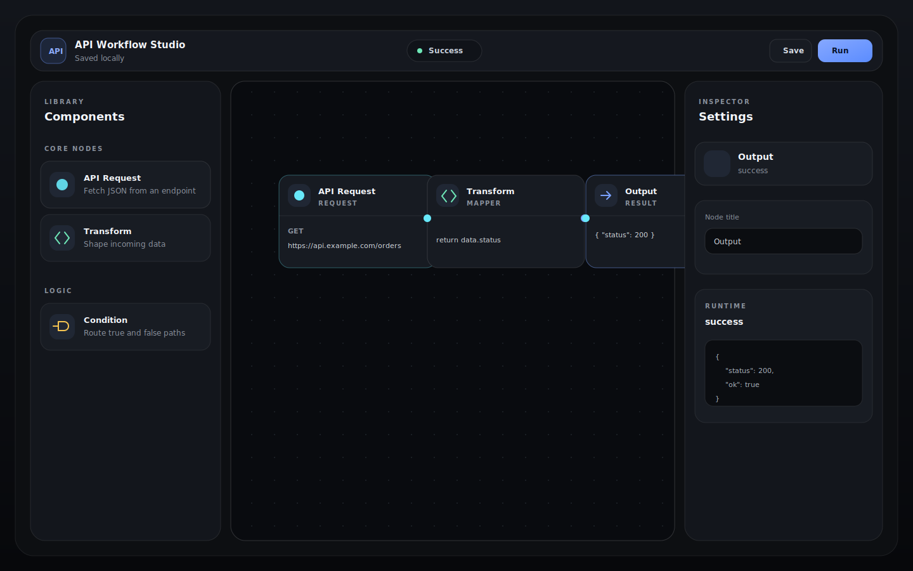

# Visual API Workflow Builder



A React + TypeScript developer tool for building API workflows on a visual canvas. Users drag nodes from a library, connect them, edit settings in an inspector, and run a simulated workflow with per-node execution states.

This project is built as a portfolio-quality frontend application: polished SaaS UI, modular React components, typed workflow data, local persistence, and focused tests for the execution engine.

## Highlights

- Figma-style workflow canvas built with React Flow
- Custom API request, transform, condition, and output nodes
- Drag-and-drop node creation from a grouped component library
- Directional connections with input and output handles
- Live node inspector with grouped settings
- Simulated workflow execution with `idle`, `running`, `success`, and `error` states
- Save and load support through `localStorage`
- Dark, high-end SaaS visual system inspired by developer tools
- Vitest coverage for traversal, branching, errors, and cycle detection

## Tech Stack

- React 18
- TypeScript
- Vite
- React Flow
- Zustand
- Vitest
- Lucide icons

## Architecture

The app keeps UI, state, and workflow execution separate so each part is easy to reason about.

```txt
src/
  components/
    canvas/      React Flow canvas and drag/drop behavior
    layout/      App shell and top bar
    nodes/       Custom workflow node cards
    panels/      Right-side node inspector
    sidebar/     Left-side node library
  data/          Initial workflow and node template metadata
  engine/        Workflow traversal and execution logic
  state/         Zustand store for nodes, edges, selection, save/load, and run state
  types/         Shared workflow types
```

The workflow runner is intentionally isolated in `src/engine/workflowRunner.ts`. That makes it testable without rendering React and keeps execution rules out of the UI components.

## Security Note

The Transform node does not run arbitrary JavaScript with `eval` or `new Function`. It supports a constrained subset:

- `return data`
- `return data.path`
- JSON literals

That tradeoff keeps the demo safe for a browser-only portfolio project. A production workflow engine should move execution server-side, sandbox user code, validate outbound requests, enforce timeouts, and add rate limiting.

## Getting Started

```bash
npm install
npm run dev
```

Open `http://localhost:5173/`.

## Quality Checks

```bash
npm test
npm run build
npm audit
```

Current coverage focuses on the workflow engine because it contains the highest-value business logic:

- connected node traversal
- transform output propagation
- conditional false-branch routing
- unsupported transform errors
- cycle detection

## Resume Bullet

Built a visual API workflow builder in React + TypeScript using React Flow and Zustand, featuring draggable custom nodes, live inspector editing, local workflow persistence, and a simulated execution engine with tested traversal, branching, error handling, and cycle detection.

## What I Would Add Next

- Real deployment link and short demo video
- Undo and redo for canvas edits
- JSON schema validation for saved workflows
- End-to-end tests for drag/drop and inspector editing
- Server-side API execution with auth, rate limits, allowlists, and request timeouts
